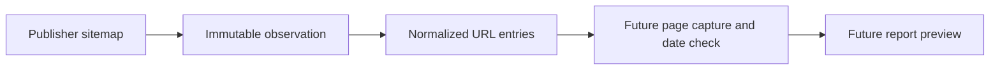

# Historical article backfill: first pilot

The target is one year of visible article reports and weekly status pages. Historical
articles need their own source record: a sitemap observation is not a feed observation,
and a sitemap `lastmod` is not an article publication date. The live article table and
downstream daily analysis can be reused once that provenance is represented honestly.

## Seven-day source check

On 2026-09-27, `scripts/probe_historical_archive.py` sampled three article URLs per
outlet per day for 2025-09-15 through 2025-09-21. It checked robots rules, fetched the
article page, required a page publication timestamp on the target Bucharest day, and
used the existing article extractor. The script saved URL and metadata evidence, not
page text.

| Outlet | Sitemap entries in the selected window | Pages sampled | Correct publication day | Usable extraction |
| --- | ---: | ---: | ---: | ---: |
| HotNews | 643 | 21 | 21 | 21 |
| Digi24 | 799 | 21 | 21 | 21 |

These are small deterministic samples, not estimates of a month's usable yield.
The same 42 pages were sampled again on 2026-09-27 with the page-only archive
extractor. All 42 had an accepted publication date on the requested day and
at least 200 characters of extracted article text. The probe discarded the
text after measuring it and did not create feed entries.
HotNews exposes daily sitemaps. Digi24 exposes a monthly sitemap; its 799 entries
were selected by `lastmod` in that week. Articles published during the week and edited
later can be absent from this slice. A full Digi24 month scan must fetch candidates
and assign the day from page publication metadata.

The sample included HotNews general news, economy, sports, and family sections, plus
Digi24 domestic and foreign news. Editorial relevance still needs a separate gate.
The check made no model calls, so it does not establish backfill model cost.

## Pilot quality measurements

The same 42-page probe ran again on 2026-09-28. Its
[metadata-only result](../../artifacts/archive-pilot-2025-09-v1/metadata-sample.json)
records all 14 outlet-days, sampled URLs, publication and modification times, section
labels, body lengths, and failures. Each outlet had three valid, extractable sample pages
on each day. All 42 pages had a modification timestamp; none failed the date or
extraction check.

| Outlet | Sitemap entries in pilot slice | Repeated exact URL entries | Sampled non-news minimum | Sample sections |
| --- | ---: | ---: | ---: | --- |
| HotNews | 643 | 0 | 2 of 21 | 16 Actualitate, 2 Copii&Părinți, 2 SuperLiga, 1 Economie |
| Digi24 | 799 | 0 | 1 of 21 | 7 actualitate, 14 externe |

The duplicate count compares exact URLs within the seven HotNews daily maps and the
selected `lastmod` slice of Digi24's September map. It does not detect different URLs
for the same story. A headline and section review found at least three pages that did
not report a current event: [parenting advice](https://hotnews.ro/cum-sa-pui-ordine-in-haosul-de-dimineata-8-solutii-ca-sa-ajungeti-la-timp-la-scoala-2060846),
[a genetic testing explainer](https://hotnews.ro/trei-boli-ereditare-grave-au-ferestre-de-preventie-testarea-genetica-pentru-cancer-mamar-distrofie-musculara-si-talasemie-ne-ajuta-sa-indrumam-si-sa-protejam-pacientii-si-2065788),
and [a Digi24 item marked `(P)`](https://www.digi24.ro/stiri/actualitate/p-intelege-pretul-pe-kwh-si-ce-platesti-de-fapt-pe-factura-de-energie-3412835).
The HotNews pages appear in a section labeled "Powered by MedLife." This is a lower
bound of 3 in 42 sampled pages, not a measured rate for all 1,442 sitemap entries.

The probe made no model calls. A separate
[seven-day report cost snapshot](../../artifacts/jev-research-v1/news-report-model-cost-v1.json)
attributes $2.032867430 to 497 relevance outputs from 2026-09-14 through 2026-09-20,
about $0.00409 per relevance output including downstream report work. Applying that
observed ratio to all 1,442 pilot-slice URLs gives roughly $5.90, if every URL became an
analysis input and the later week's cost mix held. Digi24's `lastmod` slice misses
articles edited later, and the estimate excludes rejected pages and unlinked attempts.
It is not a measured 2025 pilot cost or a spend limit.

The sample supports extraction and two-source availability on seven days. It does not
establish full-day coverage, acceptable editorial mix, a model budget, or permission
for bulk full-text retention. Those checks still gate a pilot go decision.

## Publication boundary

The current [Digi24 terms](https://www.digi24.ro/termeni-si-conditii) restrict copying
and republication, and the [HotNews terms](https://hotnews.ro/termeni-si-conditii-de-utilizare-ale-site-ului-hotnews-ro-1642230)
limit commercial content use without written consent. Bulk retention of full article
text or republication must be resolved before a historical capture run for these
outlets. Source metadata and URL discovery can proceed without publishing articles.

The discovery command records immutable sitemap observations and normalized URL
entries with outlet, retrieval time, and `lastmod` hints. It does not label those
hints as publication times or retain article text. Run it in bounded date ranges:

```sh
uv run python scripts/discover_historical_archive.py \
  --outlet hotnews --start 2025-09-15 --end 2025-09-21
uv run python scripts/discover_historical_archive.py \
  --outlet digi24 --start 2025-09-15 --end 2025-09-21
```

The Digi24 command records its entire September sitemap because the source offers
monthly files. The identical sitemap body maps to the same observation ID on
replay, and canonical URLs appear once per observation. Later capture must verify
the page publication timestamp, enforce source-specific retention, and keep
retrospective reports in preview until coverage and disclosure checks pass.

The next bounded job checks article pages for title, exact publication timestamp,
later modification timestamp, redirect validity, and a page digest. It discards
page HTML after checking and stores no article text. A sitemap `lastmod` never
becomes `published_at`. Invalid and conflicting page dates are recorded as
rejections. Failed requests can retry after one day. Each run checks at most 100
URLs and waits at least one second between article requests.

```sh
uv run python scripts/check_historical_archive_pages.py \
  --outlet hotnews --start 2025-09-15 --end 2025-09-21 --limit 50
```


